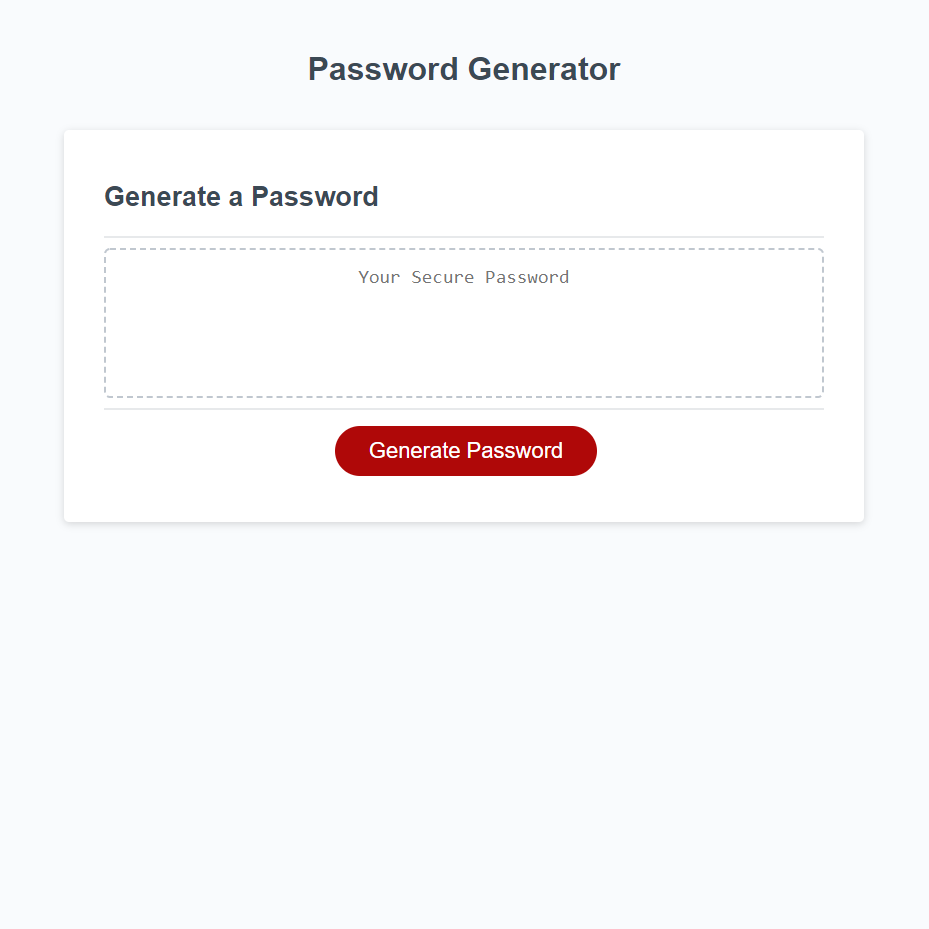

# password-generator

This is a password generator that asks the user a series of questions about how many and what kind of characters they want their password to be composed of.

## Purpose

The purpose of this project was to practice using javascript.

## Goal

The goal of this project was to provide a randomly generated password that meets the user's criteria.

## Deployment

See below for a screenshot of the application and a link to the deployed web page.

https://struelensc.github.io/password-generator/

